# alg-demo
## Klassendiagramm

- Die grau eingefärbten Klassen sind Java FX Controller und haben jeweils eine assozierte .fxml Datei.

| Package                           | Description                                                                                                                                                                  |
|-----------------------------------|------------------------------------------------------------------------------------------------------------------------------------------------------------------------------|
| ch.fhnw.algdemo.control           | Beinhaltete alle Java FX Controller. Jede Klasse hat eine entsprechende UI Definition in einem .fxml File im Ordner resources. Dort ist die selbe Ordnerstruktur angewendet. |
| ch.fhnw.algdemo.control.algorithm | Beinhaltet die FX Controller für die verschiedenen Algorithmen, welche in diesem Algorithmen Demonstrator genutzt werden können.                                             |
| ch.fhnw.algdemo.control.history   | Beinhaltet die FX Controller für die Command History, welche in der Applikation auf der rechten Seite ersichtlich ist.                                                       |
| ch.fhnw.algdemo.control.variable  | Beinhaltet die FX Controller für die Variablen-Übersicht, welche in der Applikation auf der linken Seite ersichtlich ist.                                                    |
| ch.fhnw.algdemo.model             | Beinhaltet die applikationsspezifischen Datenmodelle, welche der Algorithmen Demonstrator verwendet.                                                                         |
| ch.fhnw.algdemo.util              | Beinhaltet Helferklassen wie z.B. CommandParser.                                                                                                                             |

## Mockups

### Merge Sort

  
Merge Sort:

  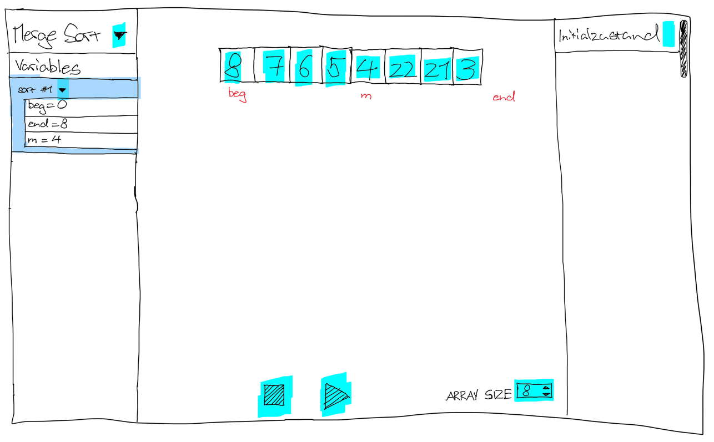
  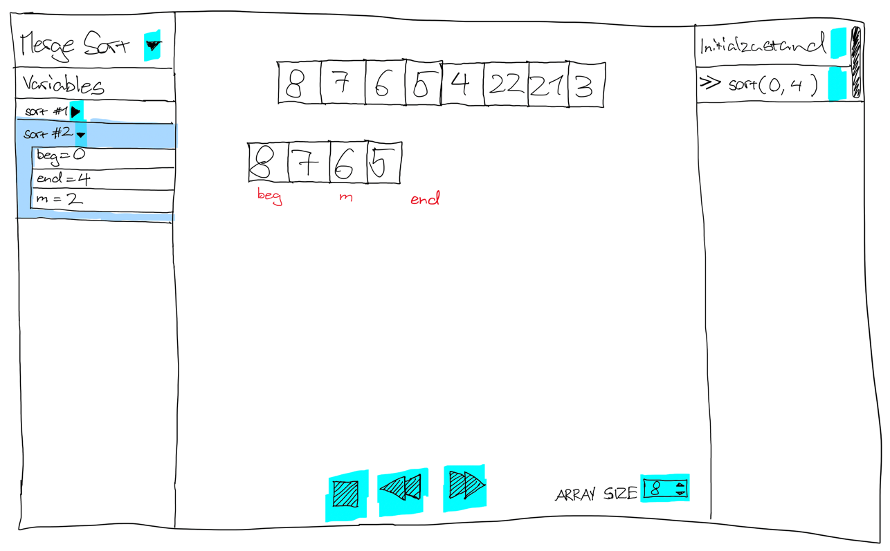
  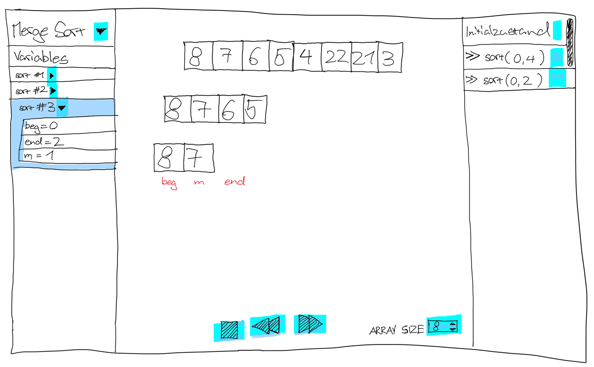
  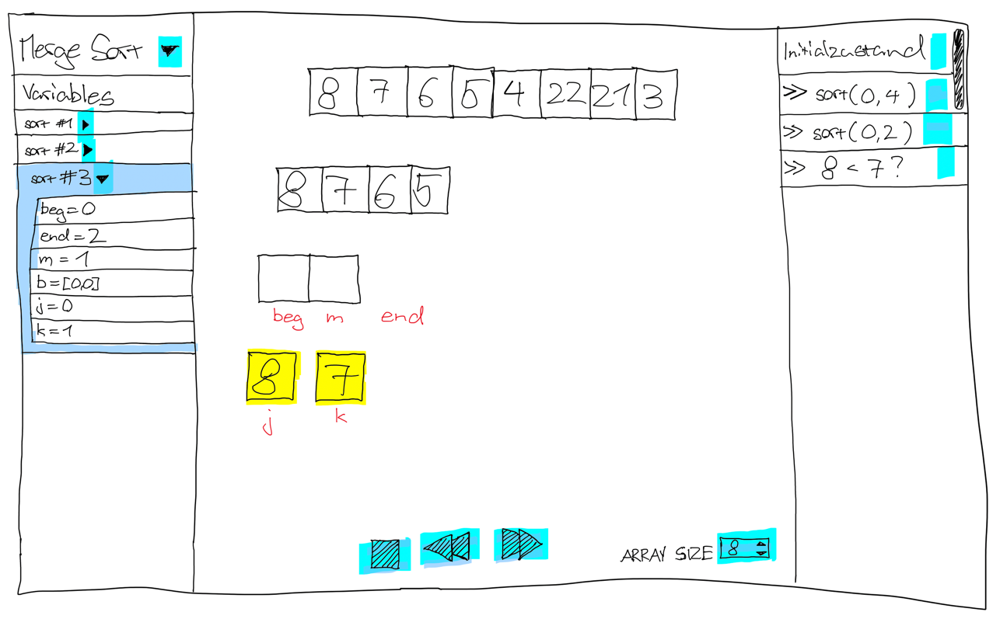
  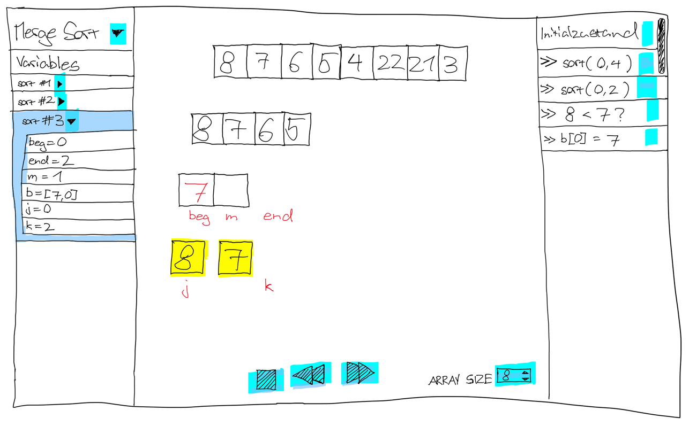
  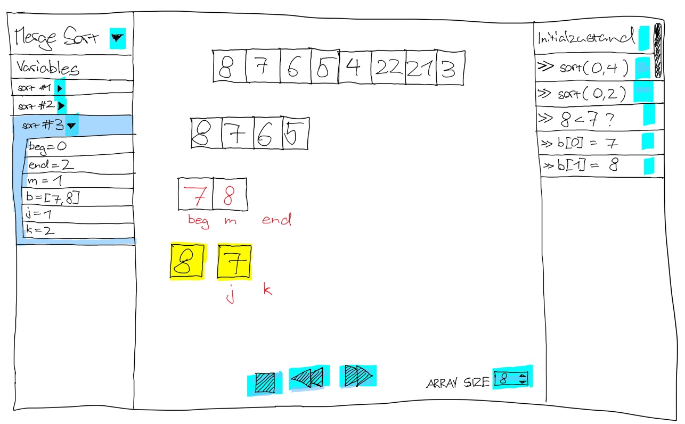
  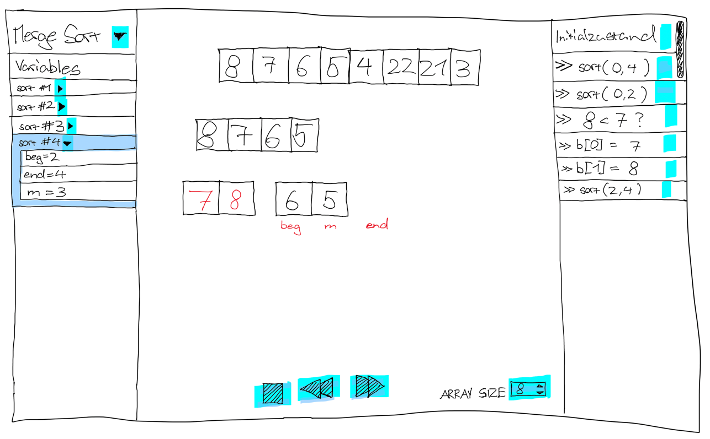
  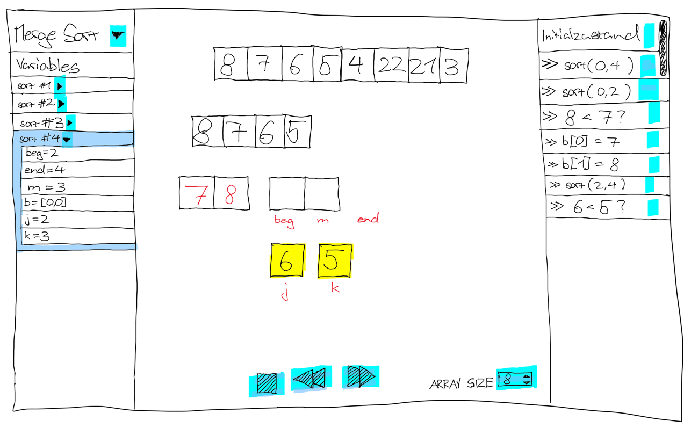
  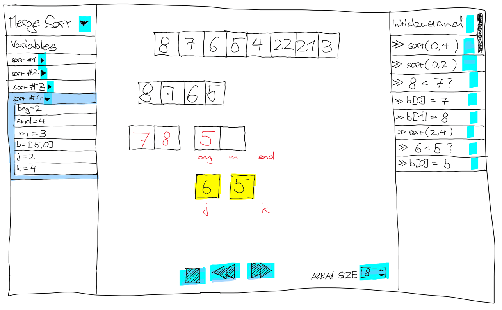
  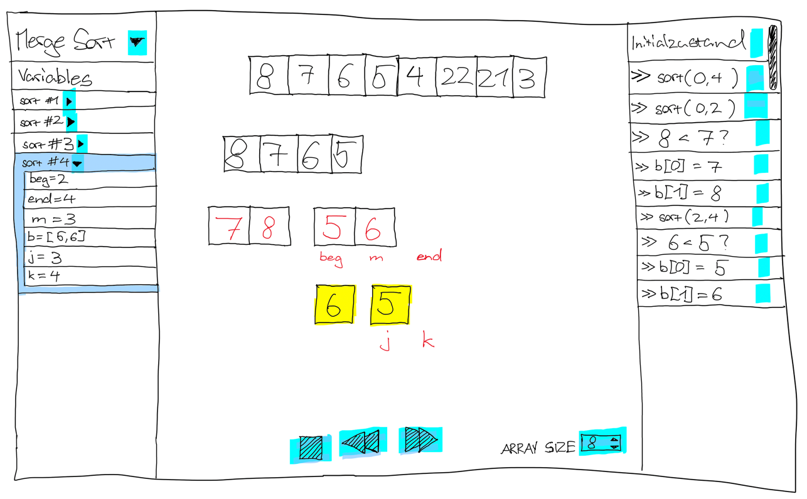
  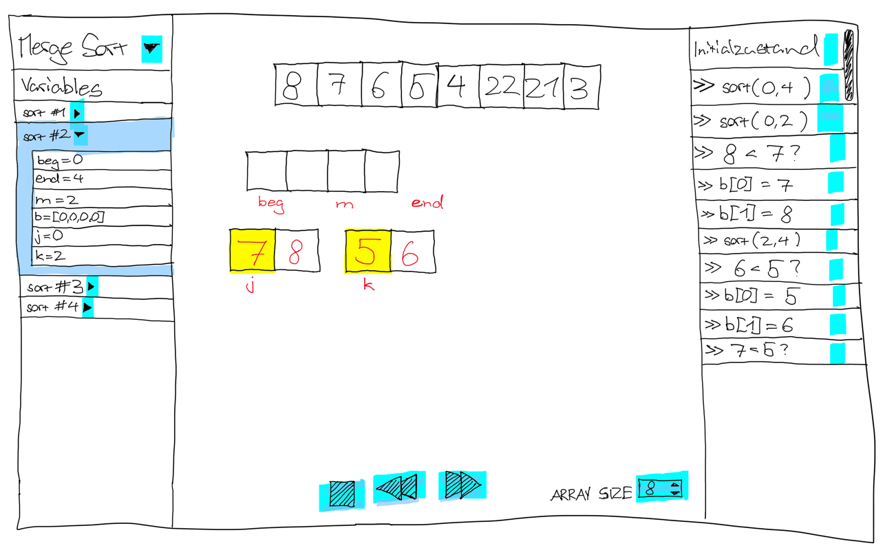
  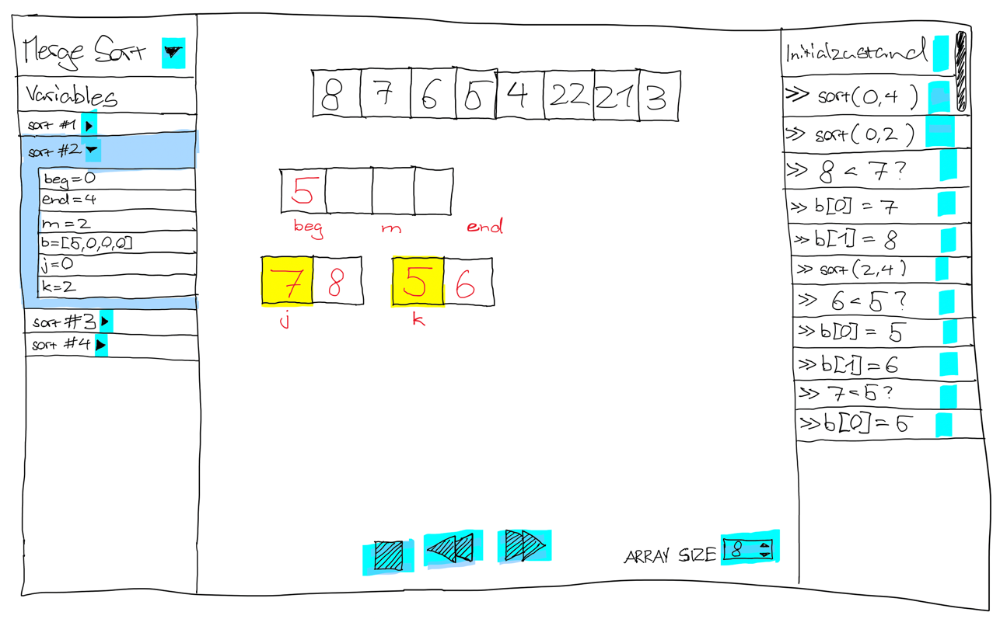
  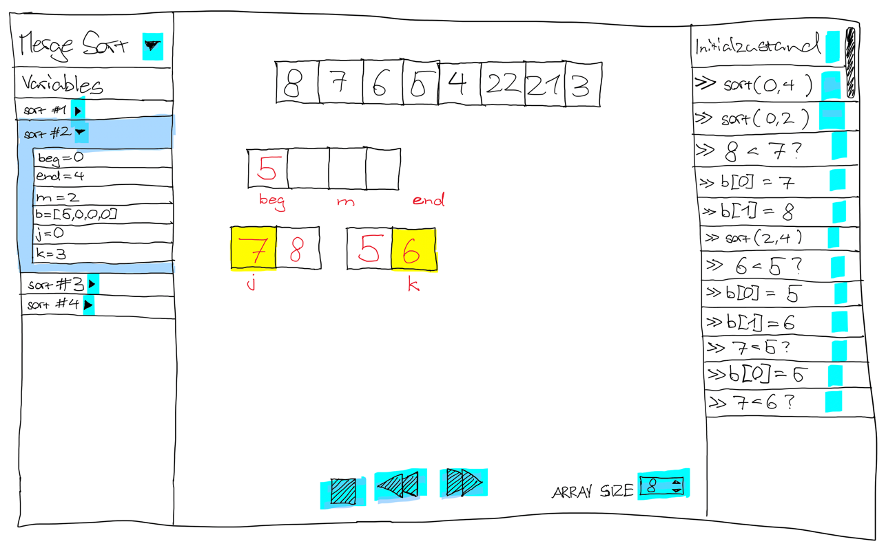
  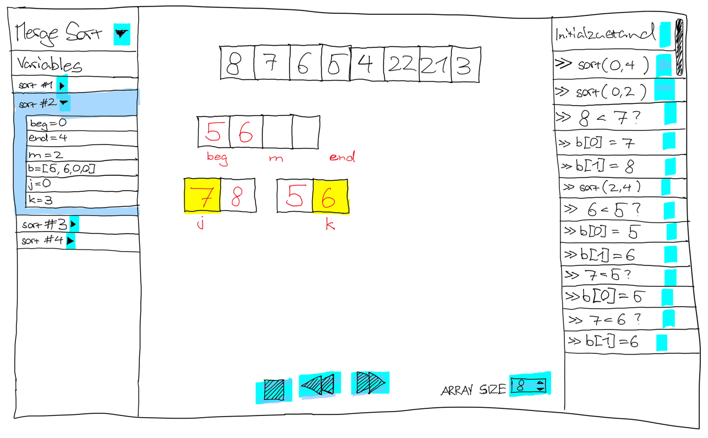
  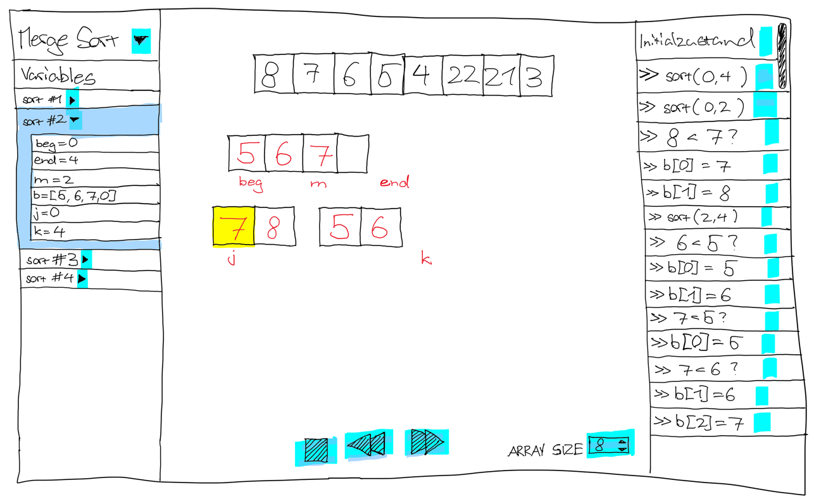
  
  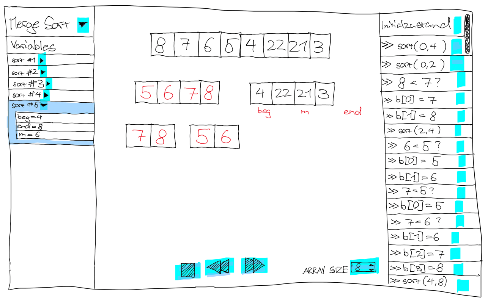

### Binary Search

  
Command durch Auswahl wählen:

  
  
  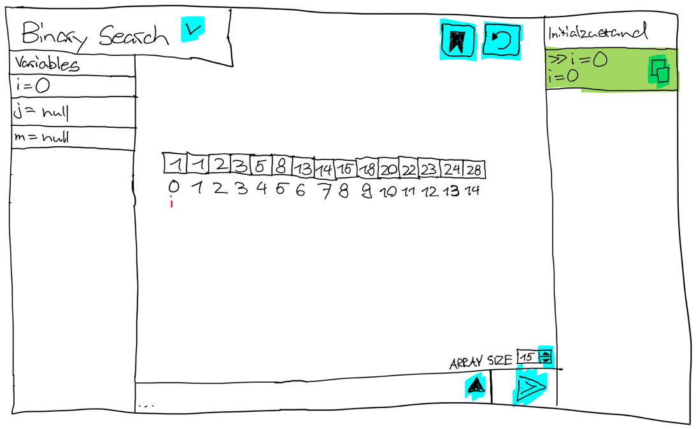

  
Fehlerhafter Command ausführen:

  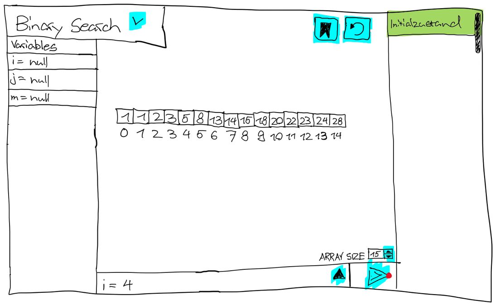
  
  
  

  
Durch History zurückspringen:

  
  
  
  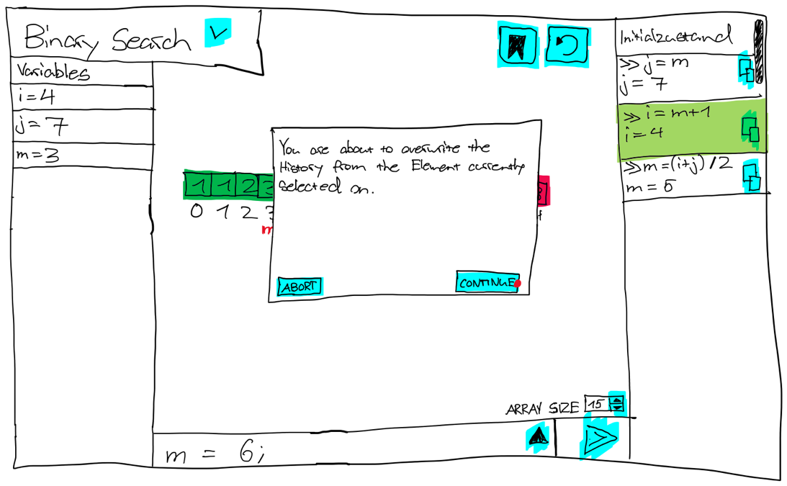
  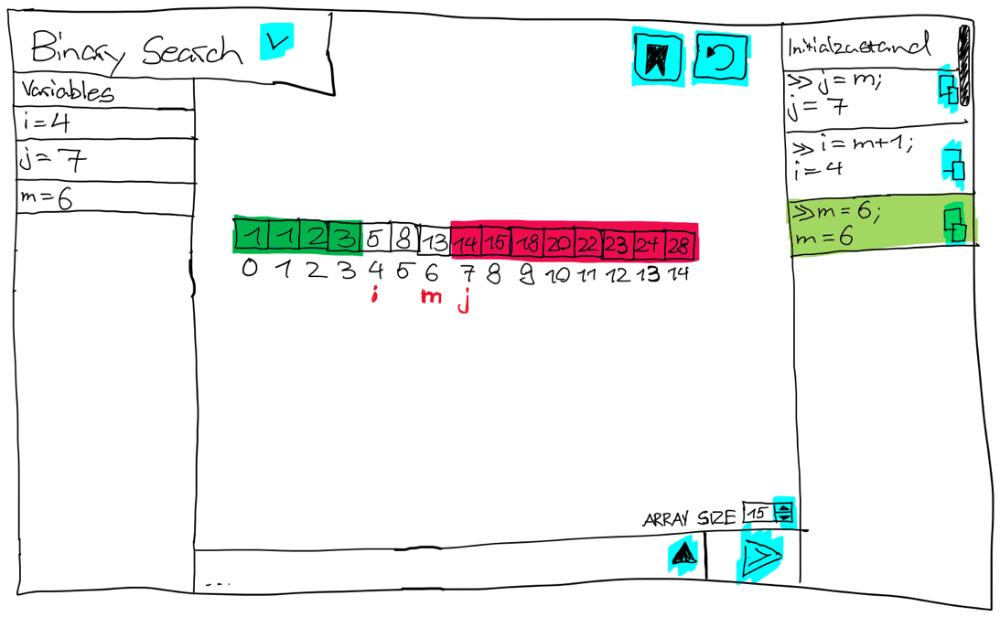

  
Durch History zurückspringen (abbrechen):

  
  
  
  
  

### Funktionalitäten
- Switch zwischen verschiedenen Algorithmen möglich.
  - Als erstes Umsetzung für Binary Search
  - Zweiter Algorithmus MergeSort(Noch nicht zu 100%)
- Anzeige des aktuellen Status des Algorithmus in der Mitte. 
  - Zeigt je nach Algorithmus auch gerade die Variablen(wie hier im Beispiel mit Binary Search).
    - Bearbeiten des Arrays vom Algorithmus möglich.
    - Aktuelle Values vom Algorithmus speichern 
    - Letzte gespeicherte Config laden
- Anzeigen von aktuellen Variablenbelegungen.
- Textfeld für Eingabe eines Commands für den Algorithmus mit Sendeknopf.
  - Absenden & ausführen des Commands durch den Sendeknopf.
- History aller abgesetzten Commands. 
  - Durch Klicken auf ein History-Element wird der Status nach dieses Commands wieder hergestellt und ist in der Mitte sichtbar. 
  - Durch Klicken auf das Kopier-Icon eines History Elements den verwendeten Command in das Textfeld einfügen.

- [ ] Binary Search Algorithmus
    - [x] Der Zustand des Algorithmus wird angezeigt.
    - [x] Commands können auf den Algorithmus angewendet werden.
    - [x] Das Array vom BinarySearch kann bearbeitet werden.
    - [ ] Das Bearbeiten des Arrays wird validiert.
    - [ ] Die Arraygrösse kann verändert werden.
    - [ ] Der Zustand des Algorithmus kann gespeichert werden.
    - [ ] Der Zustand des Algorithmus kann aus dem gespeicherten Zustand wiederhergestellt werden.
- [x] Commands
    - [x] Es gibt Command vorschläge, welche ausgewählt werden können.
    - [x] Commands können selbst eingegeben werden.
    - [x] Commands können abgesetzt werden.
    - [x] Commands werden überprüft.
- [x] History
    - [x] Die History wird angezeigt.
    - [x] In der History gibt es einen Eintrag für den Initialzustand.
    - [x] Für jeden abgesetzten Command wird ein Historyeintrag erstellt.
    - [x] Überläuft die History den Bildschirm, so ist sie scrollable.
    - [x] Commands aus der History können kopiert werden.
    - [x] Der Zustand des Algorithmus kann durch die History verändert werden.

## Zielgruppe
- Software-Entwickelnde Personen, welche die Algorithmen BinarySearch &/ MergeSort am Erlernen sind.
- Sie kennen bereits die grundlegende Idee dieser Algorithmen.
- Sie beherrschen bereits fundamentale Kenntnisse über die Softwareentwicklung in Java.
- Sie wollen verschiedene Zustände der Algorithmen mit eignen Variablenzuweisungen spezifisch steuern und erkunden.
- Sie wollen für jeden Zustand der Algorithmen jeweils eine sinnvolle Visualisierung haben.

## User Szenarien
### User Szenario 1: Ungültiges Suchintervall
1. Aktion: Benutzer wählt in der gestarteten Applikation BinarySearch aus.
    - Gedanken: Was geschieht, wenn der Index i grösser als der Index j wird?
2. Aktion: Benutzer schickt die Commands i=4; j=7; m=6; jeweils einzeln, der Reihe nach ab.
    - Gedanken: Mit einem normalen Suchintervall starten.
3. Aktion: Benutzer beobachtet den Zustand des Algorithmus in der Visualisierung und schickt dann den Command i=8; ab.
    - Gedanken: Das Suchintervall macht jetzt keinen Sinn mehr im Kontext von BinarySearch: i ist grösser als j.
4. Aktion: Benutzer beobachtet den Zustand des Algorithmus in der Visualisierung in der Mitte.
    - Gedanken: Ach so sieht es aus, wenn ein Command angewendet wurde, welcher das Suchintervall ungültig macht!
5. Aktion: Benutzer klickt in der History auf den letzten gültigen abgesetzten Command.
    - Gedanken: Ich will nochmals den Zustand nach dem letzten Schritt ansehen, um den Unterschied zu verstehen.

### User Szenario 2: Schrittweise Binary Search verstehen
1. Aktion: Benutzer wählt in der gestarteten Applikation BinarySearch aus und sieht das Standard-Array [2, 5, 8, 12, 16, 23, 38, 45, 56, 67, 72, 75, 86, 91, 97]
    - Gedanken: Ich suche nach dem Wert 16 bei Index 4.
2. Aktion: Benutzer schickt die Commands i=0; j=14; m=(i+j)/2; jeweils einzeln, der Reihe nach ab.
    - Gedanken: Ich sehe, dass nun m = 7 und der Wert bei Index 7 ist 45. Also ist 16 im linken Teil des Arrays.
3. Aktion: Benutzer schickt die Commands j=m; m=(i+j)/2; jeweils einzeln, der Reihe nach ab.
    - Gedanken: Ich sehe, dass nun j = 7 & m = 3 und der Wert bei Index 3 ist 12. Also ist 16 nun rechts von m.
4. Aktion: Benutzer schickt die Commands i=m+1; m=(i+j)/2; jeweils einzeln, der Reihe nach ab.
    - Gedanken: Ich sehe, dass nun i = 4 & m = 5 und der Wert bei Index 5 ist 23. Also ist 16 nun links von m.
5. Aktion: Benutzer schickt die Commands j=m; m=(i+j)/2; jeweils einzeln, der Reihe nach ab.
    - Gedanken: Ich sehe, dass nun j = 5 & m = 4 und der Wert bei Index 4 ist 16. Gefunden!
6. Aktion: Benutzer klickt sich durch die Command History.
    - Gedanken: Jetzt kann ich jeden Schritt noch einmal durchgehen und die Visualisierung des Zustandes in der Mitte verstehen.

### User Szenario 3: In eigenem Array suchen
1. Aktion: Benutzer wählt in der gestarteten Applikation BinarySearch aus und sieht das Standard-Array [2, 5, 8, 12, 16, 23, 38, 45, 56, 67, 72, 75, 86, 91, 97]
    - Gedanken: Ich möchte in meinem eigenen Array suchen, damit ich auch wirklich verstehen kann was im Algorithmus geschieht.
2. Aktion: Benutzer gibt seine Arraywerte in den Textboxen der BinarySearch Visualisierung ein.
    - Gedanken: Das Standard-Array ist zu lang! Mein Array hat nur eine länge von 10 und nicht von 14!
3. Aktion: Benutzer ändert die Grösse des Arrays auf 10 durch das Textfeld, welches unten rechts im Bildschirm zu sehen ist.
    - Gedanken: Perfekt! Nun stimmt die Grösse!
4. Aktion: Benutzer klickt auf den Knopf oben rechts, um die aktuelle Konfiguration des Arrays zu speichern.
    - Gedanken: Super jetzt kann ich das nächste Mal nach dem Starten des Algorithmus-Demonstrators direkt diese Konfiguration laden.

### Key Take Aways
  - Funktionalität in der Applikation, mit welcher der Benutzer entscheiden kann, welche Variable von i & j welchen
    schon gesuchten Bereich abdeckt, wäre von Wert. Da somit verschiedene Varianten des BinarySearch im
    Algorithmus-Demonstrator erlernt werden können.
  - Wenn ein Command angewendet wird, welcher im Kontext von BinarySearch keinen Sinn macht resp. das Suchintervall 
    ungültig macht, dann sollte der Benutzer auf das hingewiesen werden.
  - Die Default-Values in den Textboxen des BinarySearch sollten stärker unterscheidbarer von den Indexen sein.
  - Eine Funktionalität, bei welcher der Benutzer die Zahl festlegen kann, welche er im Array suchen möchte, wäre toll.
    Somit könnte der Algorithmus-Demonstrator auch rückmelden, wenn die gesuchte Zahl gefunden wurde.
  - Funktionalität für die Arraygrösse zu verändern wäre auch von Wert.
  - Funktionalität für die aktuelle Konfiguration des Arrays zu speichern und wieder zu laden wäre nice to have.
    Wahrscheinlich jedoch nicht die höchste Priorität.

## Test Szenarien
### Test Szenario 1: Initialer Zustand
1. Aktion: Benutzer startet die Algorithmus-Demonstrator Applikation neu.
    - Resultat:
      - In der ChoiceBox oben links ist der Algorithmus BinarySearch ausgewählt.
      - In der linken Spalte sind die Variablen i, j & m zu sehen. ALle haben den Value null zugewiesen.
      - In der mittleren Spalte ist ein indexiertes Array von Integer Values zu sehen. Darunter steht "Variable Options" und in der ChoiceBox rechts von diesem Text ist der Value "1: i=0,j=n-1" ausgewählt.
      - In der mittleren Spalte ganz unten ist ein leeres Textfeld und der Button "Execute" zu sehen.
      - in der rechten Spalte gibt es ein Element mit dem Text "Initial State", welches leicht grau angefärbt ist.

### Test Szenario 2: Commands absetzen
1. Aktion: Benutzer startet die Algorithmus-Demonstrator Applikation neu.
2. Aktion: Benutzer gibt im Textfeld unten in der Mitte den Text "i = 0" ein und klickt auf "Execute".
    - Resultat:
      - In der Spalte auf der linken Seite des Bildschirms steht bei der Variable i nun "i = 0".
      - Im Array auf der Mitte des Bildschirmes sind nun alle Werte ausgegraut und unter dem Index 0 steht ein rotes i.
      - In der Spalte auf der rechten Seite des Bildschirmes hat es ein neues Element zum gerade abgesetzten Command. 
        Es steht ">> i = 0" und darunter "i = 0". Rechts davon hat es einen Button mit dem Text "Copy".
        Dieses neue Element ist leicht grau angefärbt.
3. Aktion: Benutzer gibt im Textfeld unten in der Mitte den Text "j = 13" ein und klickt auf "Execute".
    - Resultat:
        - In der Spalte auf der linken Seite des Bildschirms steht bei der Variable j nun "j = 13".
        - Im Array auf der Mitte des Bildschirmes unter dem Index 13 steht ein rotes j.
        - In der Spalte auf der rechten Seite des Bildschirmes hat es ein neues Element zum gerade abgesetzten Command.
          Es steht ">> j = 13" und darunter "j = 13". Rechts davon hat es einen Button mit dem Text "Copy".
          Dieses neue Element ist leicht grau angefärbt.
4. Aktion: Benutzer gibt im Textfeld unten in der Mitte den Text "m = (i + j) / 2" ein und klickt auf "Execute".
    - Resultat:
        - In der Spalte auf der linken Seite des Bildschirms steht bei der Variable m nun "m = 6".
        - Im Array auf der Mitte des Bildschirmes sieht man nun die Zahl beim Index 6 und darunter steht ein rotes m.
        - In der Spalte auf der rechten Seite des Bildschirmes hat es ein neues Element zum gerade abgesetzten Command.
          Es steht ">> m = (i + j) / 2" und darunter "m = 6". Rechts davon hat es einen Button mit dem Text "Copy".
          Dieses neue Element ist leicht grau angefärbt.
5. Aktion: Benutzer gibt im Textfeld unten in der Mitte den Text "i = m + 1" ein und klickt auf "Execute".
    - Resultat:
        - In der Spalte auf der linken Seite des Bildschirms steht bei der Variable i nun "i = 7".
        - Im Array auf der Mitte des Bildschirmes ist unter dem Index 7 nun das rote i zu sehen. Unter dem Index 0 ist kein rotes i mehr zu sehen.
          Alle Elemente des Arrays bis und mit Index 6 sind blau eingefärbt.
        - In der Spalte auf der rechten Seite des Bildschirmes hat es ein neues Element zum gerade abgesetzten Command.
          Es steht ">> i = m + 1" und darunter "i = 7". Rechts davon hat es einen Button mit dem Text "Copy".
          Dieses neue Element ist leicht grau angefärbt.
6. Aktion: Benutzer gibt im Textfeld unten in der Mitte den Text "m = (i + j) / 2" ein und klickt auf "Execute".
    - Resultat:
        - In der Spalte auf der linken Seite des Bildschirms steht bei der Variable m nun "m = 10".
        - Im Array auf der Mitte des Bildschirmes sieht man nun die Zahl beim Index 10 und darunter steht ein rotes m.
          Unter dem Index 6 ist kein rotes m mehr zu sehen.
        - In der Spalte auf der rechten Seite des Bildschirmes hat es ein neues Element zum gerade abgesetzten Command.
          Es steht ">> m = (i + j) / 2" und darunter "m = 10". Rechts davon hat es einen Button mit dem Text "Copy".
          Dieses neue Element ist leicht grau angefärbt.
7. Aktion: Benutzer gibt im Textfeld unten in der Mitte den Text "j = m" ein und klickt auf "Execute".
    - Resultat:
        - In der Spalte auf der linken Seite des Bildschirms steht bei der Variable j nun "j = 10".
        - Im Array auf der Mitte des Bildschirmes ist unter dem Index 10 nun zusätzlich zum roten i auch das m zu sehen. Unter dem Index 13 ist kein rotes j mehr zu sehen.
          Alle Elemente des Arrays von Index 11 bis und mit Index 13 sind dunkelgelb eingefärbt.
        - In der Spalte auf der rechten Seite des Bildschirmes hat es ein neues Element zum gerade abgesetzten Command.
          Es steht ">> j = m" und darunter "j = 10". Rechts davon hat es einen Button mit dem Text "Copy".
          Dieses neue Element ist leicht grau angefärbt.
8. Aktion: Benutzer gibt im Textfeld unten in der Mitte den Text "m = (i + j) / 2" ein und klickt auf "Execute".
    - Resultat:
        - In der Spalte auf der linken Seite des Bildschirms steht bei der Variable m nun "m = 8".
        - Im Array auf der Mitte des Bildschirmes sieht man nun die Zahl beim Index 8 und darunter steht ein rotes m.
          Unter dem Index 10 ist kein rotes m mehr zu sehen.
        - In der Spalte auf der rechten Seite des Bildschirmes hat es ein neues Element zum gerade abgesetzten Command.
          Es steht ">> m = (i + j) / 2" und darunter "m = 8". Rechts davon hat es einen Button mit dem Text "Copy".
          Dieses neue Element ist leicht grau angefärbt.

### Test Szenario 3: History Navigation
1. Aktion: Benutzer startet die Algorithmus-Demonstrator Applikation neu.
2. Aktion: Benutzer gibt im Textfeld unten in der Mitte den Text "i = 0" ein und klickt auf "Execute".
3. Aktion: Benutzer gibt im Textfeld unten in der Mitte den Text "j = 13" ein und klickt auf "Execute".
4. Aktion: Benutzer gibt im Textfeld unten in der Mitte den Text "m = (i + j) / 2" ein und klickt auf "Execute".
5. Aktion: Benutzer gibt im Textfeld unten in der Mitte den Text "j = m" ein und klickt auf "Execute".
6. Aktion: Benutzer gibt im Textfeld unten in der Mitte den Text "m = (i + j) / 2" ein und klickt auf "Execute".
7. Aktion: Benutzer gibt im Textfeld unten in der Mitte den Text "i = m + 1" ein und klickt auf "Execute".
8. Aktion: Benutzer gibt im Textfeld unten in der Mitte den Text "m = (i + j) / 2" ein und klickt auf "Execute".
    - Resultat:
      - In der Spalte auf der linken Seite des Bildschirms stehen die folgenden Einträge:
        - "i = 4"
        - "j = 6"
        - "m = 5"
      - Im Array auf der Mitte des Bildschirmes sieht man:
        - Unter Index 4 ein rotes i.
        - Unter Index 5 ein rotes m.
        - Unter Index 6 ein rotes j.
        - Die aufgedeckten Zahlen bei Index 3, 5 & 6.
        - Alle Elemente des Arrays von Index 0 bis und mit 3 sind blau eingefärbt. 
        - Alle Elemente des Arrays von Index 7 bis und mit 13 sind dunkelgelb eingefärbt. 
      - In der Spalte auf der rechten Seite des Bildschirmes hat es für jeden abgesetzten Command ein Element in der Historie.
        Das neueste Element ist leicht grau angefärbt.
9. Aktion: Benutzer klickt in der Command-History in der rechten Spalte des Bildschirmes auf das 5. Element ">> j = m". 
    - Resultat: 
      - Im Mitte des Bildschirms sieht man nun den Zustand bis und mit zum Command des gerade angeklickten History-Elementes:
        - In der Spalte auf der linken Seite des Bildschirms stehen die folgenden Einträge:
          - "i = 0"
          - "j = 6"
          - "m = 6"
        - Im Array auf der Mitte des Bildschirmes sieht man:
            - Unter Index 0 ein rotes i.
            - Unter Index 6 ein rotes j & m.
            - Die aufgedeckte Zahl bei Index 6.
            - Alle Elemente des Arrays von Index 7 bis und mit 13 sind dunkelgelb eingefärbt.
      - In der rechten Spalte des Bildschirmes ist das 5. Element der Historie ">> j = m" leicht grau angefärbt.
10. Aktion: Benutzer gibt im Textfeld unten in der Mitte den Text "i = m + 1" ein und klickt auf "Execute".
    - Resultat:
        - Vom zuvor ausgewählten Zustand aus wird nun der neue Command angewendet.
          In der Spalte auf der rechten Seite des Bildschirmes wurden alle Elemente nach dem 5. Element ">> j = m" gelöscht.
          An 6. Stelle steht nun ">> m = (i + j) / 2" und darunter "m = 3". Rechts davon hat es einen Button mit dem Text "Copy".
          Dieses neue Element ist leicht grau angefärbt.
        - In der Mitte des Bildschirmes wird dieser neue Zustand des Algorithmus abgebildet:
          - In der Spalte auf der linken Seite des Bildschirms stehen die folgenden Einträge:
                 - "i = 0"
                 - "j = 6"
                 - "m = m"
          - Im Array auf der Mitte des Bildschirmes sieht man:
              - Unter Index 0 ein rotes i.
              - Unter Index 3 ein rotes m.
              - Unter Index 6 ein rotes j.
              - Die aufgedeckten Zahlen bei Index 3 & 6.
              - Alle Elemente des Arrays von Index 7 bis und mit 13 sind dunkelgelb eingefärbt.
11. Aktion: Benutzer klickt in der Command-History in der rechten Spalte des Bildschirmes auf das 1. Element "Initial State".
    - Resultat:
        - Im Mitte des Bildschirms sieht man nun den Initialen Zustand:
            - In der Spalte auf der linken Seite des Bildschirms stehen die folgenden Einträge:
                - "i = null"
                - "j = null"
                - "m = null"
            - Im Array auf der Mitte des Bildschirmes sieht man nun wieder alle Values des Arrays aufgedeckt.
              Es sind keine roten Variablen zu sehen und keine Stellen des Arrays sind eingefärbt.
        - In der rechten Spalte des Bildschirmes ist das 1. Element der Historie "Initial State" leicht grau angefärbt.

### Test Szenario 4: Variable Optionen
1. Aktion: Benutzer startet die Algorithmus-Demonstrator Applikation neu.
2. Aktion: Benutzer gibt im Textfeld unten in der Mitte den Text "i = 1" ein und klickt auf "Execute".
3. Aktion: Benutzer gibt im Textfeld unten in der Mitte den Text "j = 12" ein und klickt auf "Execute".
    - Resultat:
        - Das Element bei Index 0 des Arrays ist blau eingefärbt.
        - Das Element bei Index 13 des Arrays ist dunkelgelb eingefärbt.
4. Aktion: Benutzer wählt bei der ChoiceBox rechts von "Variable Options" die Option "2: i=0, j=n".
   - Resultat:
     - Das Element bei Index 0 des Arrays ist blau eingefärbt.
     - Die Elemente bei Index 12 & 13 des Arrays sind dunkelgelb eingefärbt.
5. Aktion: Benutzer wählt bei der ChoiceBox rechts von "Variable Options" die Option "3: i=-1, j=n-1".
    - Resultat:
        - Die Elemente bei Index 0 & 1 des Arrays sind blau eingefärbt.
        - Das Element bei Index 13 des Arrays ist dunkelgelb eingefärbt.
6. Aktion: Benutzer wählt bei der ChoiceBox rechts von "Variable Options" die Option "4: i=-1, j=n".
    - Resultat:
        - Die Elemente bei Index 0 & 1 des Arrays sind blau eingefärbt.
        - Die Elemente bei Index 12 & 13 des Arrays sind dunkelgelb eingefärbt.

### Test Szenario 5: Benutzerführung
1. Aktion: Benutzer startet die Algorithmus-Demonstrator Applikation neu.
2. Aktion: Benutzer gibt im Textfeld unten in der Mitte den Text "i = 0" ein und klickt auf "Execute".
3. Aktion: Benutzer gibt im Textfeld unten in der Mitte den Text "j = 13" ein und klickt auf "Execute".
4. Aktion: Benutzer gibt im Textfeld unten in der Mitte den Text "m = (i + j) / 2" ein und klickt auf "Execute".
5. Aktion: Benutzer gibt im Textfeld unten in der Mitte den Text "j = m" ein und klickt auf "Execute".
6. Aktion: Benutzer klickt beim 4. Element der Command Historie "m = (i + j) / 2" auf den "Copy" Button.
    - Resultat:
      - Im Textfeld unten in der Mitte erscheint der Text "m = (i + j) / 2".
7. Aktion: Benutzer klickt auf "Execute".
8. Aktion: Benutzer gibt im Textfeld unten in der Mitte den Text "i = m + 1" ein und klickt auf "Execute".
9. Aktion: Benutzer gibt im Textfeld unten in der Mitte den Text "m = (i + j) / 2" ein und klickt auf "Execute".
10. Aktion: Benutzer gibt im Textfeld unten in der Mitte den Text "j = i - 1" ein und klickt auf "Execute".
    - Resultat:
      - In der Spalte auf der rechten Seite des Bildschirmes hat es ein neues Element zum gerade abgesetzten Command.
        Es steht ">> j = i - 1" und darunter steht in Rot die Meldung: "Assignment seems illogical. Variable j should not be smaller than Variable i"
        Bei diesem Element hat es rechts keinen Button mit dem Text "Copy".
        Dieses neue Element ist auch nicht leicht grau angefärbt, sondern das letzte erfolgreiche Element.
11. Aktion: Benutzer gibt im Textfeld unten in der Mitte den Text "i = j + 1" ein und klickt auf "Execute".
    - Resultat:
      - In der Spalte auf der rechten Seite des Bildschirmes hat es ein neues Element zum gerade abgesetzten Command.
        Es steht ">> i = j + 1" und darunter steht in Rot die Meldung: "Assignment seems illogical. Variable i should not be greater than Variable j"
        Bei diesem Element hat es rechts keinen Button mit dem Text "Copy".
        Dieses neue Element ist auch nicht leicht grau angefärbt, sondern das letzte erfolgreiche Element.
12. Aktion: Benutzer gibt im Textfeld unten in der Mitte den Text "i = 22" ein und klickt auf "Execute".
    - Resultat:
      - In der Spalte auf der rechten Seite des Bildschirmes hat es ein neues Element zum gerade abgesetzten Command.
        Es steht ">> i = 22" und darunter steht in Rot die Meldung: "Assignment seems illogical. Value 22 should be between -1 and 14"
        Bei diesem Element hat es rechts keinen Button mit dem Text "Copy".
        Dieses neue Element ist auch nicht leicht grau angefärbt, sondern das letzte erfolgreiche Element.
13. Aktion: Benutzer gibt im Textfeld unten in der Mitte den Text "m = j + 1" ein und klickt auf "Execute".
    - Resultat:
      - In der Spalte auf der rechten Seite des Bildschirmes hat es ein neues Element zum gerade abgesetzten Command.
        Es steht ">> m = j + 1" und darunter steht in Rot die Meldung: "Assignment seems illogical. Variable m should be between Variables i & j"
        Bei diesem Element hat es rechts keinen Button mit dem Text "Copy".
        Dieses neue Element ist auch nicht leicht grau angefärbt, sondern das letzte erfolgreiche Element.
14. Aktion: Benutzer gibt im Textfeld unten in der Mitte den Text "m = i - 1" ein und klickt auf "Execute".
    - Resultat:
      - In der Spalte auf der rechten Seite des Bildschirmes hat es ein neues Element zum gerade abgesetzten Command.
        Es steht ">> m = i - 1" und darunter steht in Rot die Meldung: "Assignment seems illogical. Variable m should be between Variables i & j"
        Bei diesem Element hat es rechts keinen Button mit dem Text "Copy".
        Dieses neue Element ist auch nicht leicht grau angefärbt, sondern das letzte erfolgreiche Element.
15. Aktion: Benutzer gibt im Textfeld unten in der Mitte den Text "m = (i + j) / 2" ein und klickt auf "Execute".
    - Resultat:
        - In der Spalte auf der rechten Seite des Bildschirmes ist die Fehlermeldung der letzten Aktion aus der Historie verschwunden.
          Es hat jedoch nun anstelle des Fehlers ein neues Element zum gerade abgesetzten Command.
          Es steht ">> m = (i + j) / 2" und darunter "m = 5". Rechts davon hat es einen Button mit dem Text "Copy".
          Dieses neue Element ist leicht grau angefärbt.

### Test Szenario 6: Tastatursteuerung
1. Aktion: Benutzer startet die Algorithmus-Demonstrator Applikation neu.
    - Resultat:
      - Die Choicebox oben links in der Ecke ist ausgewählt und hat einen dünnen blauen Rand um dies ersichtlich zu machen. 
2. Aktion: Benutzer klickt so viele mal auf den Tab Key der Tastatur, bis wieder die Choicebox oben links in der Ecke ausgewählt ist.
    - Resultat:
      - Zuerst navigiert man mit tab durch alle Textfield-Elemente des Arrays in der Mitte des Bildschirms.
        Diese haben jeweils einen dünnen blauen Rand um die momentane Selection ersichtlich zu machen.
      - Anschliessend wird die ChoiceBox rechts von "Variable Options" ausgewählt und hat einen dünnen blauen Rand um dies ersichtlich zu machen.
      - Anschliessend wird das TextField unten in der Mitte ausgewählt und hat einen dünnen blauen Rand um dies ersichtlich zu machen.
      - Anschliessend wird der Button "Execute" ausgewählt und hat einen dünnen blauen Rand um dies ersichtlich zu machen.
      - Zum Schluss wird das History Element "Initial State" ausgewählt und hat einen dünnen blauen Rand & eine blaue Hintergrundfarbe um dies ersichtlich zu machen.
3. Aktion: Benutzer navigiert mit dem Tab Key der Tastatur, bis die ChoiceBox rechts von "Variable Options" ausgewählt ist. Der Benutzer klickt auf die Enter Taste.
    - Resultat:
        - Es werden alle Optionen dieser ChoiceBox angezeigt.
4. Aktion: Benutzer klickt die Escape Taste der Tastatur.
    - Resultat:
        - Die Optionen der Choicebox verschwinden wieder.
5. Aktion: Benutzer navigiert mit dem Tab Key der Tastatur, bis das TextField unten in der Mitte ausgewählt ist. Der Benutzer klickt auf die Enter Taste.
    - Resultat:
        - Es werden Command Vorschläge für jede Variable angezeigt. 
6. Aktion: Benutzer navigiert mit den Pfeiltasten zu dem Commandvorschlag "m = (i + j) / 2" und klickt die Enter Taste
    - Resultat:
        - Im TextField unten in der Mitte erscheint der Text "m = (i + j) / 2".
        - Die Command Vorschläge werden nicht mehr angezeigt.
7. Aktion: Benutzer gibt im Textfeld unten in der Mitte den Text "i = 0" ein und klickt auf "Execute".
8. Aktion: Benutzer gibt im Textfeld unten in der Mitte den Text "j = 13" ein. Benutzer navigiert mit dem Tab Key der Tastatur, bis das TextField unten in der Mitte ausgewählt ist. Der Benutzer klickt auf die Enter Taste.
    - Resultat:
      - In der Mitte des Bildschirms sieht man nun den Zustand bis und mit zum neusten Command in der Command History:
          - In der Spalte auf der linken Seite des Bildschirms stehen die folgenden Einträge:
              - "i = 0"
              - "j = 13"
              - "m = null"
          - Im Array auf der Mitte des Bildschirmes sieht man:
              - Unter Index 0 ein rotes i.
              - Unter Index 13 ein rotes j.
          - In der rechten Spalte des Bildschirmes ist das 3. Element der Historie ">> j = 13" leicht grau angefärbt.
9. Aktion: Benutzer navigiert mit dem Tab Key der Tastatur, bis das 2. History Element ">> i = 0" ausgewählt ist. Der Benutzer klickt auf die Enter Taste.
    - Resultat:
      - In der Mitte des Bildschirms sieht man nun den Zustand bis und mit zum 2. Command in der Command History:
        - In der Spalte auf der linken Seite des Bildschirms stehen die folgenden Einträge:
            - "i = 0"
            - "j = null"
            - "m = null"
        - Im Array auf der Mitte des Bildschirmes sieht man:
            - Unter Index 0 ein rotes i.
        - In der rechten Spalte des Bildschirmes ist das 2. Element der Historie ">> i = 0" leicht grau angefärbt.
10. Aktion: Benutzer navigiert mit dem Tab Key der Tastatur, bis der "Copy" Button des 3. History Elementes "j = 13" ausgewählt ist. Der Benutzer klickt auf die Enter Taste.
    - Resultat:
        - Im TextField unten in der Mitte erscheint der Text "j = 13".

## ToDos
- [x] How to Feedbackmarkt
- [x] Commands können durch Enter-Taste auf Button oder Textfield abgesetzt werden.
- [x] Binary Search ist Horizontal in der Mitte
- [x] Scroll Pane in History scrollt automatisch zum neusten Element
- [x] In der History gibt es einen Eintrag für den Initialzustand.
- [x] Wrap error text in history when too long
- [x] Der Zustand des Algorithmus kann durch die History verändert werden.
- [x] Termine an Wolfgang für Mo 2.2 & Do 12.2
- [x] Zielgruppe ausführlich beschreiben
- [x] User Szenarien erstellen
  - Aus Benutzersicht Schritt für Schritt Ablauf aufschreiben (mit Gedanken)
- [x] Tasks erstellen/ändern & priorisieren anhand der Erkenntnisse der User Szenarien
- [x] Default Values in den Textboxen des BinarySearch unterscheidbarer von den Indexen machen.
- [x] Code Cleanup(Invarianten) & Review von Wolfgang anfordern
- [x] Fehler in der History sollen nicht angeklickt werden können.
- [x] Es können Commands mit Variablen +, -, (, ), / genutzt werden.
- [x] 'recursive descent parser' anschauen & implementieren
- [x] Unit Tests schreiben, um sicherzugehen, dass command parsing korrekt funktioniert
- [x] Mehr die Sicht eines Computers einnehmen -> es sind nur die Werte sichtbar, bei welchen m schon war.
- [x] Wenn von einem Zustand aus, welcher nicht der aktuellste ist, ein neuer Command abgesetzt wird, wird die History von dort aus fortgesetzt. (Mit Pop-up & Bestätigung)
- [x] Dokumentation für Freeze: 
  - [x] Was muss ich mir aufschreiben, damit ich im August noch weiss, was ich gemacht habe?
    - Mithilfe dieses Readme.md & der angewendeten Struktur des Projektes ist dies für mich gegeben.
  - [x] Was muss ich mir aufzeichnen/aufschreiben, damit man schnell weiss, wo man hin muss für etwas zu ändern? 
    - Klassendiagramm mit den notwendigsten Beziehungen erstellen.
  - [x] Packet/Komponenten Diagramm + Leseanleitung: Welches package hat welche Aufgabe. Welche Klasse ist in welchem package.
- [x] Benutzer darauf hinweisen, wenn ein Command angewendet wird, welcher im Kontext von BinarySearch keinen Sinn macht resp. das Suchintervall ungültig macht
- [x] Benutzer kann entscheiden, welche Variable von i & j welchen schon gesuchten Bereich abdecken.
  - [x] zuerst herausfinden was die verschiedenen Möglichkeiten sind
      - 

Möglichkeiten
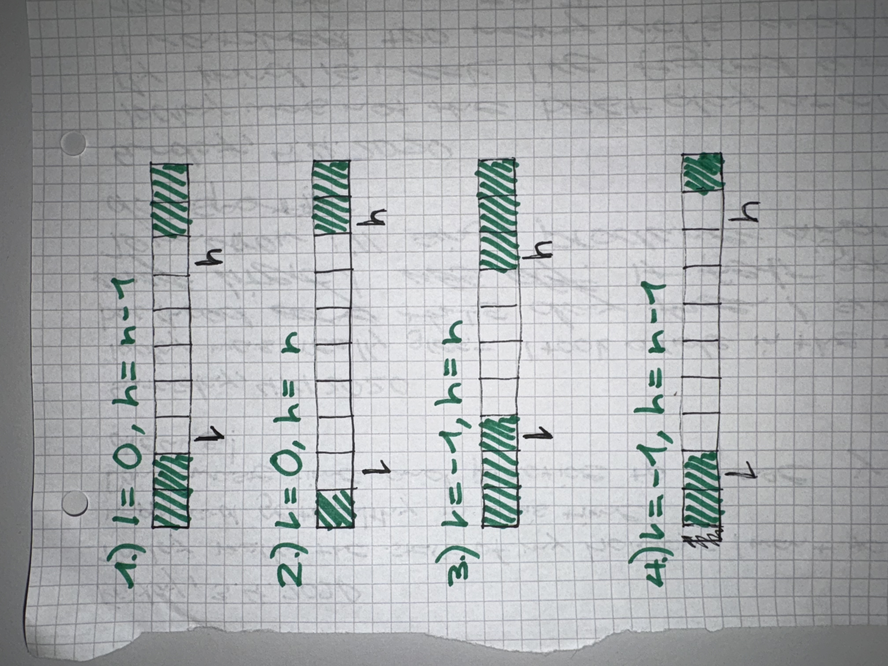

- [x] Manuelle Test Szenarien Liste erstellen
- [x] Package Diagramm - oder Tabelle. Was ist für was zuständig.
- [x] Wieder auf Wolfgang zugehen im August.
- [x] Wie geht es mir dann in einem halben Jahr beim Wiedereinstieg ins Projekt? Half mir die Dokumentation?
- [x] Bottom-Up Merge Sort Mockups erstellen, um herauszufinden ob besser als eigener Algorithmus behandeln oder als Variante.
  - Als eigener Algorithmus macht mehr Sinn. -> Applikation umsetzen, so dass es einfach erweiterbar ist.
- [x] Top-Down Merge Sort Mockups verbessern mit Feedback von Wolfgang umgesetzt.
- [x] Mockups für Präsentation aufbereiten und klare Fragestellungen überlegen.
- [x] Bei ArrayGrössen zwischen 2er Potenzen, die 2er resp. die 3er Gruppen nochmals splitten.
- [x] JavaFX: Properties mit UIElementen binden
  - [x] bind Visibility of ActionButtons to Properties
  - [x] Nur Zahlen anzeigen, welche im Tree of Action sind, wie im Mockup.
  - [x] Add Yellow Highlights in Cells that are being compared.
  - [x] Änderungen der Zahlen im Array nach Mockup umsetzen
  - [x] One für One nach oben schreiben visualisieren(dafür benötigt es mehr states). Schreiben mit grüner HG Farbe visualisieren.
- [x] CommandHistory visualisieren
  - [x] Fix SelectedCommandId Highlighting
  - [x] fix Behaviour of Buttons: Stop, Start, Previous & Next
- - [x] Hide Copy Button for MergeSort
- [x] Zahlen im initialen Array veränderbar machen. Alle anderen Arrays unbearbeitbar machen.  
- [x] Trennlinie zwischen dem obersten Array und den anderen implementieren
- [x] FontGrösse der Box anpassen -> grösser.
- [x] Grösse der Boxen immer gleich gross oder zumindest die Grösse der Box grösser als die Lücken
- [x] Index Variablen unter den Arrays veranschaulichen
- [x] Die Vergleiche im obersten a-Array auch gelb markieren
- [x] Beim Vergleich/Zwischenspeicher b-Array zuerst leeren und dann hineinmergen: mit state namen b
- [x] In der Visualisation die Arrays jeweils mit A & B markieren.
- [x] Variable-View für MergeSort umsetzen
- [ ] Textgrösse mitskalieren: (kann man das anhand der boxgrösse rechnen)

- [ ] Was will ich nun machen mit welcher Priorität?
  - Applikation refactoren, so dass sie optimal bereit ist um den neuen Algorithmus MergeSort zu implementieren.
  - MergeSort Demonstrator Top-Down implementieren.
  - (Merge Sort Demonstrator Bottom-Up implementieren.)
- [ ] Was will ich vom nächsten Feedbackmarkt mitnehmen?
    - Feedback zum BinarySearch Demonstrator einholen.
      - Was ist nicht intuitiv? Was erscheint unlogisch? (& müsste geändert werden)?
      - Feedback zu Usability & Experience?
- [ ] Macht MergeSort zum Demonstrieren überhaupt Sinn? Welche Aspekte davon vielleicht mehr und welche weniger?
  - Operationen:
    - int m = (beg + end) / 2;
    - int i = 0, j = beg, k = m;
    - var b = new double[end - beg];
    - b[i++] = a[j++];
    - b[i++] = a[k++];
    - a[y] = b[i];
  - Ich möchte bei MergeSort eher ein Veranschaulichen der verschiedenen Varianten Top-Down und Bottom-Up Merge Sort
    implementieren. Selbst die Länge des Arrays bestimmen können und die eigenen Zahlen vorgeben, aber dann durchklicken
    und schauen was geschieht bei jedem Schritt. DIe History soll auch mit integriert werden, um bei den verschiedenen Schritten
    zurückspulen zu können.

## Feedback HS25

### Feedback Learnshop
  - HauptPart des Algorithmus noch grösser machen.
  - Es ist nicht wirklich klar was für Commands eingesetzt werden können.
    Eine weitere Hilfe wäre toll!
  - Ist auch nicht wirklich klar, dass das Command Feld der Hauptpart ist.
  - Wäre auch cool, wenn man den Algorithmus ausführen könnte und er visualisiert wird.
      - Und dann auch vergleichen zu können, wie verschieden schnell sortiert wurde vielleicht.
  - Bessere Guidance: Wenn User Commands eingibt, welche keinen Sinn machen, dann sollte eine  
    entsprechende Rückmeldung erscheinen.
    - i wird grösser als j
    - j wird kleiner als i
    - m ist nicht zwischen i & j
    - etc.
  - Mehr die Sicht eines Computers einnehmen -> es sind nur die Werte sichtbar, bei welchen m schon war.
  - Es wird spezifisch nach einer Zahl gesucht und es kommt eine positive Rückmeldung, wenn diese 
    Zahl gefunden wurde.
  - Es kann ausgewählt werden ob i &/ j inklusiv/exklusiv des momentanen Indexes sind.
  - Mehr Gameification: Es soll mehr Spass machen. User soll mehr zum Handeln motiviert sein.

### Feedback Wolfgang

  
Feedback Wolfgang

  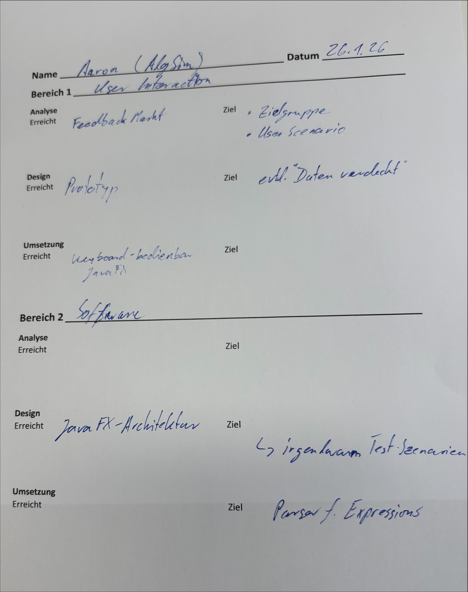

## Feedback FS26

### Feedback Wolfgang Sync Nr.1
- Binary Search:
  - Der Button für Variable-Options zu bestimmen, wurde als eine andere Funktion interpretiert vom Aussehen & Platzierung her.
    Vielleicht könnte man es klarer Darstellen mit entsprechenden Bildern, welche Inklusiv & Exklusiv darstellen.
- Merge Sort:
  - Die Zahlen in den gesplitteten Blöcken, welche bereits verglichen wurden, leeren. Damit nicht rote & schwarze Zahlen im selben Block stehen und es die Wahrheit im Rechenspeicher besser widerspiegelt. 
  - Evt. macht es Sinn die Zahlen im Ursprungsarray für die Visualisierung anders zu behandeln. Dass man bspw. immer den aktuellen Stand des Ursprungsarray sieht.
  - Da Bottom-Up Merge Sort recht stark in der Visualisierung vom Top-Down Merge Sort abweicht, sollte man ihn besser als eignen Algorithmus behandeln und nicht mit einem Varianten-Drop-Down wechseln können.
  - In der Variable-View den Rekursionsstack der genutzen Variablen ersichtlich machen. Z.B. durch Einrücken oder faltbarkeit.
- Feedbackmarkt: Mockups mit bestimmten Fragestellungen mitnehmen und so Feedback einholen.

### Feedback Learnshop
- Welche Elemente des MergeSorts sind nicht klar oder vielleicht auch verwirrend?
  - evt. History benennen
- Was müsste anders sein, dass dir diese Applikation hilft, den MergeSort optimal zu verstehen?
  - Die Variablen, welche auf Indexe der Arrays zeigen, sollten auch visualisiert werden. x2
- Wie gross ist der Mehrwert der angezeigten Variablen (da der Applikationscode des Algorithmus nicht ersichtlich ist)?
  - Hilft etwas, vor allem wenn die Indexe auch unter den Arrays visualisiert werden.
    - -> evt. nur die Variablen anzeigen, welche auch visualisiert werden.

### Feedback Wolfgang Sync Nr.1
- Im MergeSort soll das Ursprungsarray auf der obersten Ebene immer den aktuellen Stand des Arrays widerspiegeln (so wie dies im Speicher des Algos in echt auch der Fall ist).
- Arrays in der Visualisierung benennen mit a & b.
- Historyeinträge mit Referenzen auf die Arrays a & b benennen (so wie dies im Algo in echt auch der Fall ist).

## Fragen & Antworten
### Was kann der Benutzer machen, was falsch ist? Wie reagiert das System?
- Er kann einen Command abgeben, welcher falsch ist oder nichts mit dem Algorithmus zu tun hat.
    - Die Applikation merkt, dass der Command falsch ist oder keinen Effekt hat. In der History ist der falsche Command ersichtlich. In der zweiten Zeile dieses History-Elements steht jedoch nicht der Effekt einer erfolgreichen Zuweisung, sondern eine sprechende Fehlermeldung, die den Benutzer dazu leitet, einen richtigen Command einzugeben.
- Er kann durch die History in einen alten Zustand zurückspringen und von dort aus einen neuen Command absetzen.
  - Es kommt eine Warnung die bestätigt werden muss, dass das System im Begriff ist den Zustand ab dem aktuellen Zeitpunkt aus zu Überschreiben. Wenn bestätigt, löscht die Applikation alle abgesetzten Commands nach dem, welcher in der History ausgewählt ist und fügt den neuen Command danach hinzu.
### Wie kann ich den Benutzer leiten, so dass er intuitiv weiss, was zu tun ist?
- Die Variablen, welche im Algorithmus verwendet werden können, sind schon benannt. Für BinarySearch gibt es Beispielsweise die Variablen:
  - i = null
  - j = null
  - m = null
  Es können keine neuen Variablen erstellt werden. 
  Der Algorithmus kann dann durch das Zuweisen von Werten zu diesen Variablen ausprobiert werden.
- Anstelle eines normalen Textfeldes für die Eingabe der Commands, verwende ich ein Textfeld, welches schon vordefinierte Beispiele für jede Variable bietet, für alle möglichen Variablenzuweisungen.
  - Mögliche Commands:
    - Zuweisungen zu den existierenden Variablen mit demselben Datentyp:
        - i = m + 1;
        - j = 15;
        - m = (i + j) / 2;
    - Unzulässige Commands:
      - i = "ein String";
        - Nicht derselbe Datentyp
      - i = 15
        - Kein Semicolon am Schluss
      - 15;
        - Keine Zuweisung einer existierenden Variable
      - x = 5;
        - Keine Zuweisung einer existierenden Variable
      - m = i + 1;
        - Geht nicht, wenn i noch keinen Wert hat
### Was will ich vom Feedbackmarkt mitnehmen?
- Ich will meine Mitstudierenden meine Applikation ausprobieren lassen, ohne sie dabei in der Bedienung des UIs zu schulen. 
- Anschliessend will ich von Ihnen Feedback bezüglich der Bedienbarkeit der Applikation einholen und für mich festhalten. 

