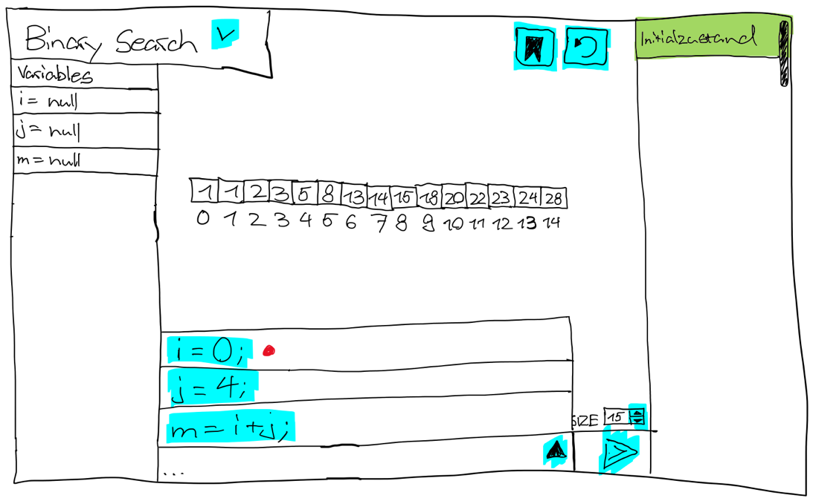
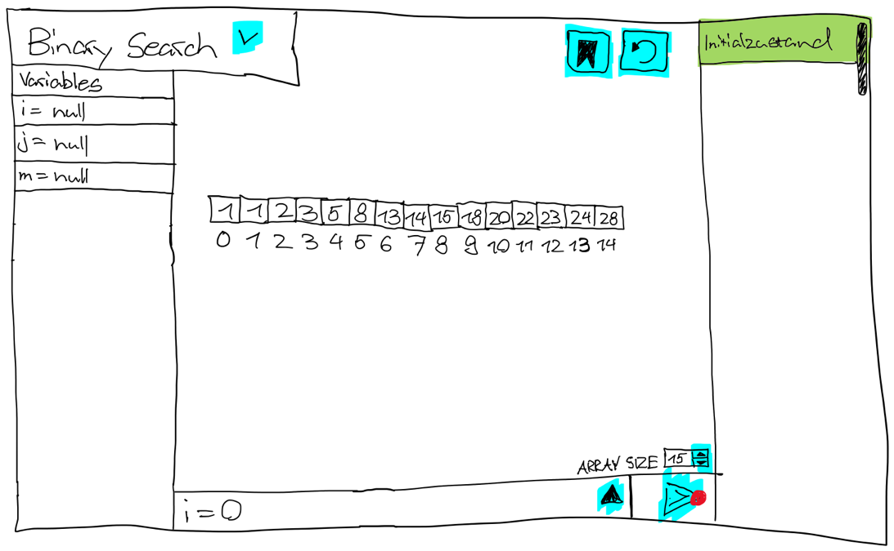
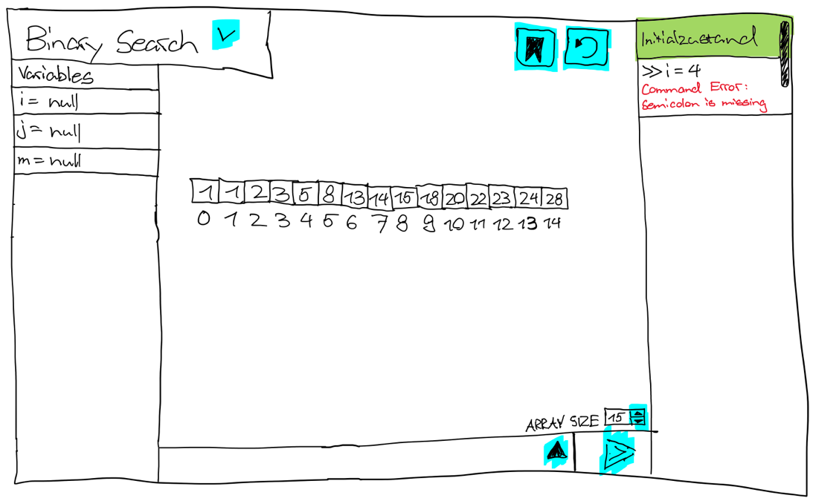
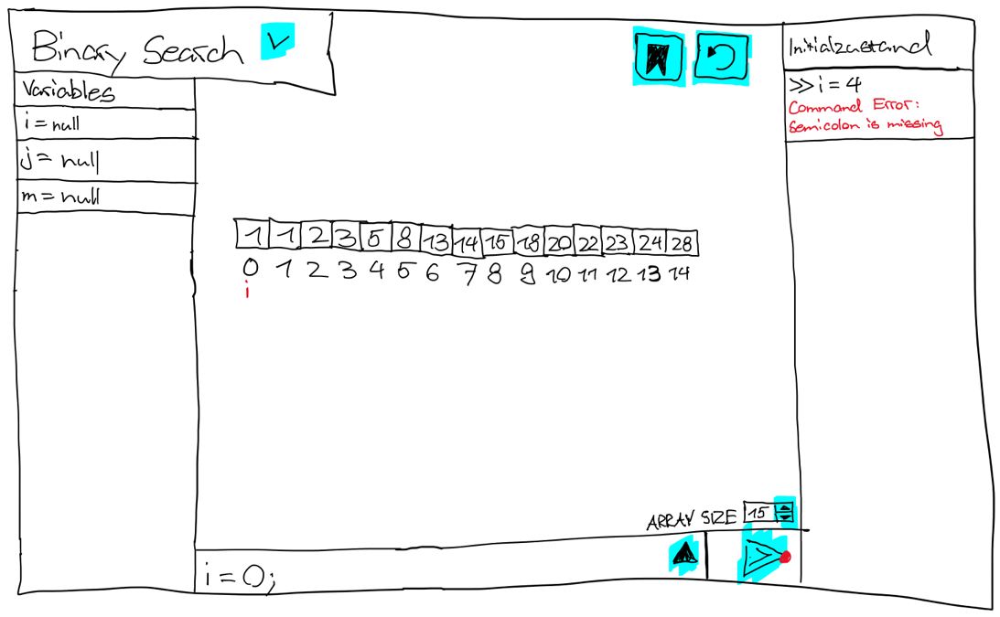
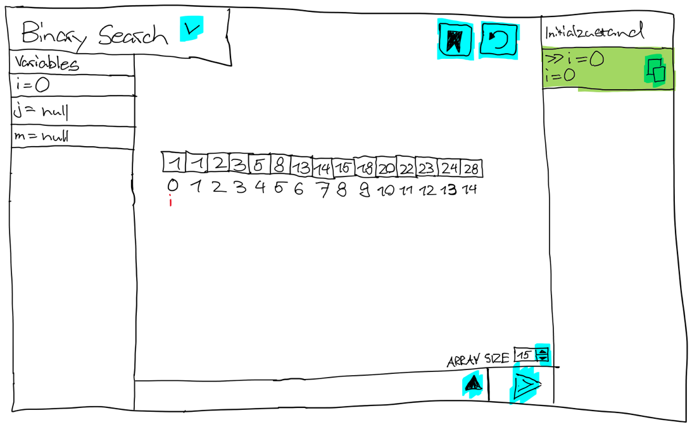
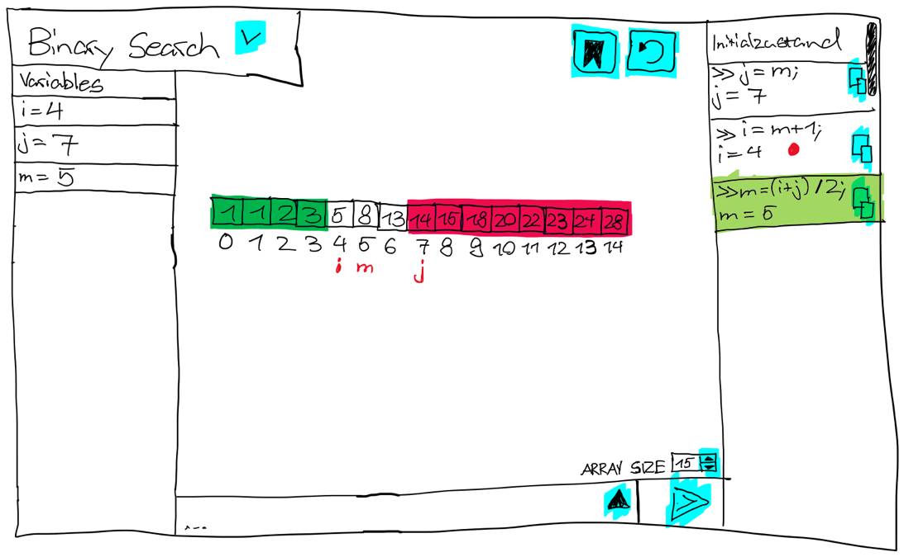
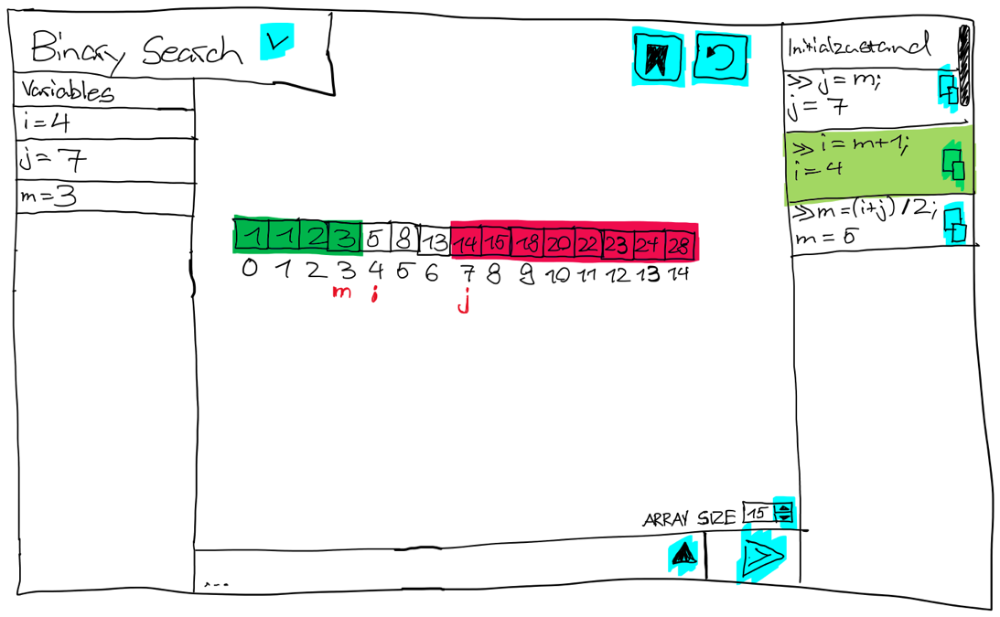
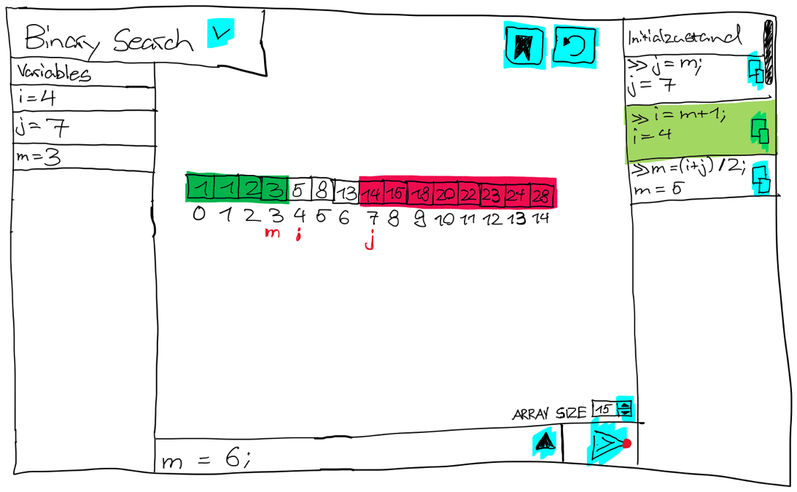
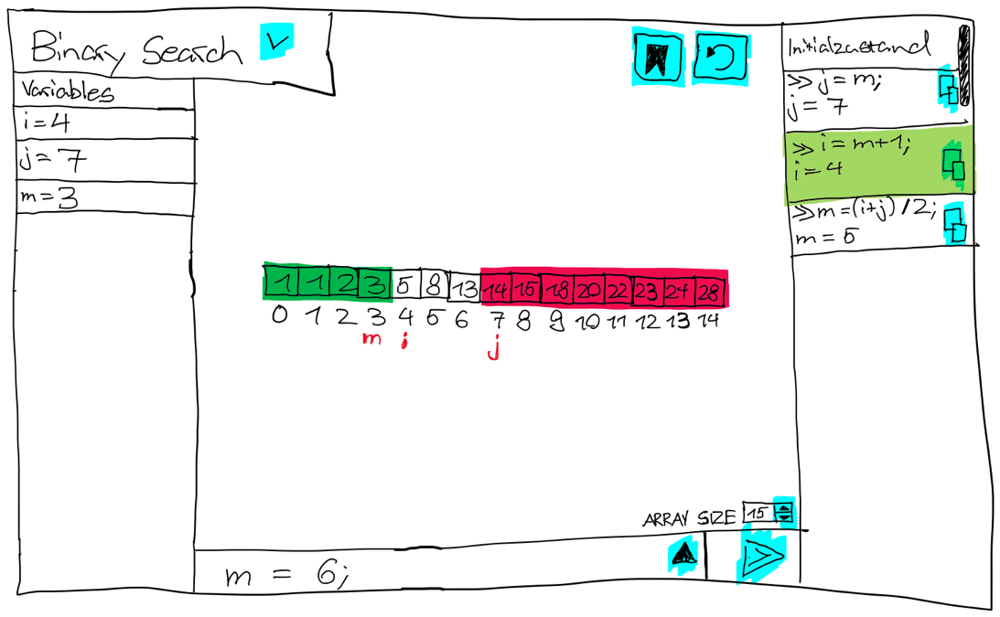

# alg-demo
## Mockups

  
Command durch Auswahl wählen:

  
  
  

  
Fehlerhafter Command ausführen:

  
  
  
  

  
Durch History zurückspringen:

  
  
  
  
  

  
Durch History zurückspringen (abbrechen):

  
  
  
  
  

### Funktionalitäten
- Switch zwischen verschiedenen Algorithmen möglich.
  - Als erstes Umsetzung für Binary Search
  - Zweiter Algorithmus MergeSort(Noch nicht zu 100%)
- Anzeige des aktuellen Status des Algorithmus in der Mitte. 
  - Zeigt je nach Algorithmus auch gerade die Variablen(wie hier im Beispiel mit Binary Search).
    - Bearbeiten des Arrays vom Algorithmus möglich.
    - Aktuelle Values vom Algorithmus speichern 
    - Letzte gespeicherte Config laden
- Anzeigen von aktuellen Variablenbelegungen.
- Textfeld für Eingabe eines Commands für den Algorithmus mit Sendeknopf.
  - Absenden & ausführen des Commands durch den Sendeknopf.
- History aller abgesetzten Commands. 
  - Durch Klicken auf ein History-Element wird der Status nach dieses Commands wieder hergestellt und ist in der Mitte sichtbar. 
  - Durch Klicken auf das Kopier-Icon eines History Elements den verwendeten Command in das Textfeld einfügen.

- [ ] Binary Search Algorithmus
    - [x] Der Zustand des Algorithmus wird angezeigt.
    - [x] Commands können auf den Algorithmus angewendet werden.
    - [x] Das Array vom BinarySearch kann bearbeitet werden.
    - [ ] Das Bearbeiten des Arrays wird validiert.
    - [ ] Die Arraygrösse kann verändert werden.
    - [ ] Der Zustand des Algorithmus kann gespeichert werden.
    - [ ] Der Zustand des Algorithmus kann aus dem gespeicherten Zustand wiederhergestellt werden.
- [ ] Commands
    - [x] Es gibt Command vorschläge, welche ausgewählt werden können.
    - [x] Commands können selbst eingegeben werden.
    - [x] Commands können abgesetzt werden.
    - [ ] Commands werden überprüft.
- [x] History
    - [x] Die History wird angezeigt.
    - [x] In der History gibt es einen Eintrag für den Initialzustand.
    - [x] Für jeden abgesetzten Command wird ein Historyeintrag erstellt.
    - [x] Überläuft die History den Bildschirm, so ist sie scrollable.
    - [x] Commands aus der History können kopiert werden.
    - [x] Der Zustand des Algorithmus kann durch die History verändert werden.

## Zielgruppe
- Software-Entwickelnde Personen, welche die Algorithmen BinarySearch &/ MergeSort am Erlernen sind.
- Sie kennen bereits die grundlegende Idee dieser Algorithmen.
- Sie beherrschen bereits fundamentale Kenntnisse über die Softwareentwicklung in Java.
- Sie wollen verschiedene Zustände der Algorithmen mit eignen Variablenzuweisungen spezifisch steuern und erkunden.
- Sie wollen für jeden Zustand der Algorithmen jeweils eine sinnvolle Visualisierung haben.

## User Scenarios
### User Scenario 1: Ungültiges Suchintervall
1. Aktion: Benutzer wählt in der gestarteten Applikation BinarySearch aus.
    - Gedanken: Was geschieht, wenn der Index i grösser als der Index j wird?
2. Aktion: Benutzer schickt die Commands i=4; j=7; m=6; jeweils einzeln, der Reihe nach ab.
    - Gedanken: Mit einem normalen Suchintervall starten.
3. Aktion: Benutzer beobachtet den Zustand des Algorithmus in der Visualisierung und schickt dann den Command i=8; ab.
    - Gedanken: Das Suchintervall macht jetzt keinen Sinn mehr im Kontext von BinarySearch: i ist grösser als j.
4. Aktion: Benutzer beobachtet den Zustand des Algorithmus in der Visualisierung in der Mitte.
    - Gedanken: Ach so sieht es aus, wenn ein Command angewendet wurde, welcher das Suchintervall ungültig macht!
5. Aktion: Benutzer klickt in der History auf den letzten gültigen abgesetzten Command.
    - Gedanken: Ich will nochmals den Zustand nach dem letzten Schritt ansehen, um den Unterschied zu verstehen.

### User Scenario 2: Schrittweise Binary Search verstehen
1. Aktion: Benutzer wählt in der gestarteten Applikation BinarySearch aus und sieht das Standard-Array [2, 5, 8, 12, 16, 23, 38, 45, 56, 67, 72, 75, 86, 91, 97]
    - Gedanken: Ich suche nach dem Wert 16 bei Index 4.
2. Aktion: Benutzer schickt die Commands i=0; j=14; m=(i+j)/2; jeweils einzeln, der Reihe nach ab.
    - Gedanken: Ich sehe, dass nun m = 7 und der Wert bei Index 7 ist 45. Also ist 16 im linken Teil des Arrays.
3. Aktion: Benutzer schickt die Commands j=m; m=(i+j)/2; jeweils einzeln, der Reihe nach ab.
    - Gedanken: Ich sehe, dass nun j = 7 & m = 3 und der Wert bei Index 3 ist 12. Also ist 16 nun rechts von m.
4. Aktion: Benutzer schickt die Commands i=m+1; m=(i+j)/2; jeweils einzeln, der Reihe nach ab.
    - Gedanken: Ich sehe, dass nun i = 4 & m = 5 und der Wert bei Index 5 ist 23. Also ist 16 nun links von m.
5. Aktion: Benutzer schickt die Commands j=m; m=(i+j)/2; jeweils einzeln, der Reihe nach ab.
    - Gedanken: Ich sehe, dass nun j = 5 & m = 4 und der Wert bei Index 4 ist 16. Gefunden!
6. Aktion: Benutzer klickt sich durch die Command History.
    - Gedanken: Jetzt kann ich jeden Schritt noch einmal durchgehen und die Visualisierung des Zustandes in der Mitte verstehen.

### User Scenario 3: In eigenem Array suchen
1. Aktion: Benutzer wählt in der gestarteten Applikation BinarySearch aus und sieht das Standard-Array [2, 5, 8, 12, 16, 23, 38, 45, 56, 67, 72, 75, 86, 91, 97]
    - Gedanken: Ich möchte in meinem eigenen Array suchen, damit ich auch wirklich verstehen kann was im Algorithmus geschieht.
2. Aktion: Benutzer gibt seine Arraywerte in den Textboxen der BinarySearch Visualisierung ein.
    - Gedanken: Das Standard-Array ist zu lang! Mein Array hat nur eine länge von 10 und nicht von 14!
3. Aktion: Benutzer ändert die Grösse des Arrays auf 10 durch das Textfeld, welches unten rechts im Bildschirm zu sehen ist.
    - Gedanken: Perfekt! Nun stimmt die Grösse!
4. Aktion: Benutzer klickt auf den Knopf oben rechts, um die aktuelle Konfiguration des Arrays zu speichern.
    - Gedanken: Super jetzt kann ich das nächste Mal nach dem Starten des Algorithmus-Demonstrators direkt diese Konfiguration laden.

### Key Take Aways
  - Funktionalität in der Applikation, mit welcher der Benutzer entscheiden kann, welche Variable von i & j welchen
    schon gesuchten Bereich abdeckt, wäre von Wert. Da somit verschiedene Varianten des BinarySearch im
    Algorithmus-Demonstrator erlernt werden können.
  - Wenn ein Command angewendet wird, welcher im Kontext von BinarySearch keinen Sinn macht resp. das Suchintervall 
    ungültig macht, dann sollte der Benutzer auf das hingewiesen werden.
  - Die Default-Values in den Textboxen des BinarySearch sollten stärker unterscheidbarer von den Indexen sein.
  - Eine Funktionalität, bei welcher der Benutzer die Zahl festlegen kann, welche er im Array suchen möchte, wäre toll.
    Somit könnte der Algorithmus-Demonstrator auch rückmelden, wenn die gesuchte Zahl gefunden wurde.
  - Funktionalität für die Arraygrösse zu verändern wäre auch von Wert.
  - Funktionalität für die aktuelle Konfiguration des Arrays zu speichern und wieder zu laden wäre nice to have.
    Wahrscheinlich jedoch nicht die höchste Priorität.

## ToDos
- [x] How to Feedbackmarkt
- [x] Commands können durch Enter-Taste auf Button oder Textfield abgesetzt werden.
- [x] Binary Search ist Horizontal in der Mitte
- [x] Scroll Pane in History scrollt automatisch zum neusten Element
- [x] In der History gibt es einen Eintrag für den Initialzustand.
- [x] Wrap error text in history when too long
- [x] Der Zustand des Algorithmus kann durch die History verändert werden.
- [x] Termine an Wolfgang für Mo 2.2 & Do 12.2
- [x] Zielgruppe ausführlich beschreiben
- [x] User Szenarien erstellen
  - Aus Benutzersicht Schritt für Schritt Ablauf aufschreiben (mit Gedanken)
- [x] Tasks erstellen/ändern & priorisieren anhand der Erkenntnisse der User Szenarien
- [x] Default Values in den Textboxen des BinarySearch unterscheidbarer von den Indexen machen.
- [x] Code Cleanup(Invarianten) & Review von Wolfgang anfordern
- [x] Fehler in der History sollen nicht angeklickt werden können.
- [x] Es können Commands mit Variablen +, -, (, ), / genutzt werden.
- [x] 'recursive descent parser' anschauen & implementieren
- [ ] Unit Tests schreiben, um sicherzugehen, dass command parsing korrekt funktioniert
- [ ] Mehr die Sicht eines Computers einnehmen -> es sind nur die Werte sichtbar, bei welchen m schon war.
- [ ] Benutzer darauf hinweisen, wenn ein Command angewendet wird, welcher im Kontext von BinarySearch keinen Sinn macht resp. das Suchintervall ungültig macht
- [ ] Benutzer kann entscheiden, welche Variable von i & j welchen schon gesuchten Bereich abdecken.
- [ ] manuelle Test Szenarien Liste erstellen
- [ ] Fix Bug where Focus is shifted away from VBox when Enter is pressed on it
- [ ] Es wird spezifisch nach einer Zahl gesucht und es kommt eine positive Rückmeldung, wenn diese gefunden wurde.
- [ ] Wenn von einem Zustand aus, welcher nicht der aktuellste ist, ein neuer Command abgesetzt wird, wird die History von dort aus fortgesetzt. (Mit Pop-up & Bestätigung)
- [ ] Das Bearbeiten des Arrays wird validiert.
- [ ] Die Arraygrösse kann verändert werden.

## Feedback Learnshop #1
  - HauptPart des Algorithmus noch grösser machen.
  - Es ist nicht wirklich klar was für Commands eingesetzt werden können.
    Eine weitere Hilfe wäre toll!
  - Ist auch nicht wirklich klar, dass das Command Feld der Hauptpart ist.
  - Wäre auch cool, wenn man den Algorithmus ausführen könnte und er visualisiert wird.
      - Und dann auch vergleichen zu können, wie verschieden schnell sortiert wurde vielleicht.
  - Bessere Guidance: Wenn User Commands eingibt, welche keinen Sinn machen, dann sollte eine  
    entsprechende Rückmeldung erscheinen.
    - i wird grösser als j
    - j wird kleiner als i
    - m ist nicht zwischen i & j
    - etc.
  - Mehr die Sicht eines Computers einnehmen -> es sind nur die Werte sichtbar, bei welchen m schon war.
  - Es wird spezifisch nach einer Zahl gesucht und es kommt eine positive Rückmeldung, wenn diese 
    Zahl gefunden wurde.
  - Es kann ausgewählt werden ob i &/ j inklusiv/exklusiv des momentanen Indexes sind.
  - Mehr Gameification: Es soll mehr Spass machen. User soll mehr zum Handeln motiviert sein.

  
Feedback Wolfgang

  

## Fragen & Antworten
### Was kann der Benutzer machen, was falsch ist? Wie reagiert das System?
- Er kann einen Command abgeben, welcher falsch ist oder nichts mit dem Algorithmus zu tun hat.
    - Die Applikation merkt, dass der Command falsch ist oder keinen Effekt hat. In der History ist der falsche Command ersichtlich. In der zweiten Zeile dieses History-Elements steht jedoch nicht der Effekt einer erfolgreichen Zuweisung, sondern eine sprechende Fehlermeldung, die den Benutzer dazu leitet, einen richtigen Command einzugeben.
- Er kann durch die History in einen alten Zustand zurückspringen und von dort aus einen neuen Command absetzen.
  - Es kommt eine Warnung die bestätigt werden muss, dass das System im Begriff ist den Zustand ab dem aktuellen Zeitpunkt aus zu Überschreiben. Wenn bestätigt, löscht die Applikation alle abgesetzten Commands nach dem, welcher in der History ausgewählt ist und fügt den neuen Command danach hinzu.
### Wie kann ich den Benutzer leiten, so dass er intuitiv weiss, was zu tun ist?
- Die Variablen, welche im Algorithmus verwendet werden können, sind schon benannt. Für BinarySearch gibt es Beispielsweise die Variablen:
  - i = null
  - j = null
  - m = null
  Es können keine neuen Variablen erstellt werden. 
  Der Algorithmus kann dann durch das Zuweisen von Werten zu diesen Variablen ausprobiert werden.
- Anstelle eines normalen Textfeldes für die Eingabe der Commands, verwende ich ein Textfeld, welches schon vordefinierte Beispiele für jede Variable bietet, für alle möglichen Variablenzuweisungen.
  - Mögliche Commands:
    - Zuweisungen zu den existierenden Variablen mit demselben Datentyp:
        - i = m + 1;
        - j = 15;
        - m = (i + j) / 2;
    - Unzulässige Commands:
      - i = "ein String";
        - Nicht derselbe Datentyp
      - i = 15
        - Kein Semicolon am Schluss
      - 15;
        - Keine Zuweisung einer existierenden Variable
      - x = 5;
        - Keine Zuweisung einer existierenden Variable
      - m = i + 1;
        - Geht nicht, wenn i noch keinen Wert hat
### Was will ich vom Feedbackmarkt mitnehmen?
- Ich will meine Mitstudierenden meine Applikation ausprobieren lassen, ohne sie dabei in der Bedienung des UIs zu schulen. 
- Anschliessend will ich von Ihnen Feedback bezüglich der Bedienbarkeit der Applikation einholen und für mich festhalten. 

